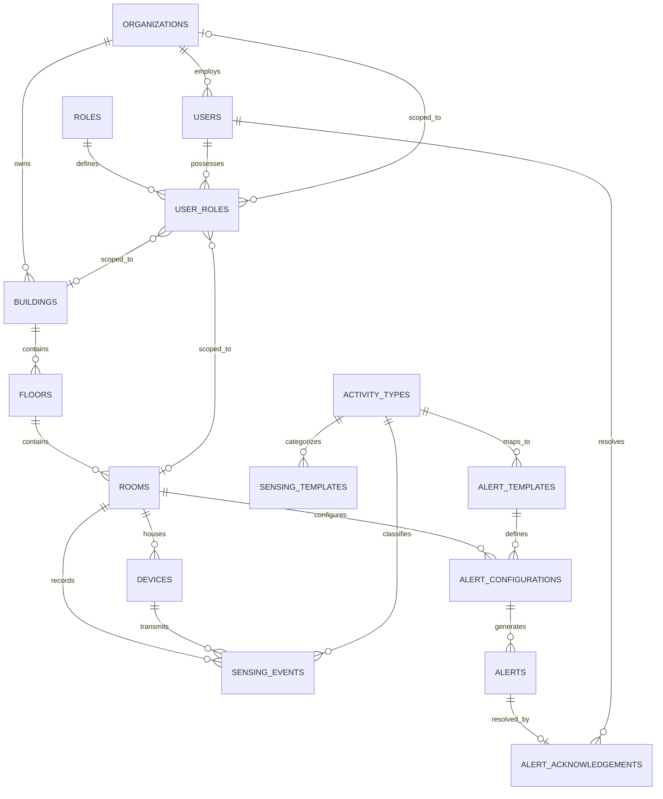

# Wi-Fi Sense: Database Design Document
**AI-Powered Indoor Monitoring and Facility Intelligence Platform Using Wi-Fi CSI**

* **Course**: MCA Academic Project (Mini Project - Phase 1)
* **Institution**: Amal Jyothi College of Engineering (Autonomous), Dept. of Computer Applications
* **Scrum Master / Guide**: Binumon Joseph
* **Document Status**: Complete & Normalized (3NF)

---

## 1. Database Architecture Overview

The database layer of the **Wi-Fi Sense** platform is designed using PostgreSQL. It is structured to support multi-tenant deployments under two distinct operational configurations on a single codebase:
1. **Elder-Care / Assisted Living**: Tracking resident presence, physical activities, and alerting caregivers of critical safety events (e.g., potential falls).
2. **Corporate / Commercial Facilities**: Tracking room occupancy status, capacity utilization metrics, and analyzing historical underutilization.

The database is fully normalized to **Third Normal Form (3NF)** to eliminate redundancy, ensure relational integrity, and provide optimal performance for high-throughput sensing data.

---

## 2. Entity-Relationship Diagram (ERD)

This Mermaid diagram shows the relational schema, constraints, and operational flows:



---

## 3. Data Dictionary

### 3.1 Organization & Infrastructure Management

#### Table: `organizations`
Stores tenant configurations for multi-tenancy.
| Column | Type | Constraints | Description |
| :--- | :--- | :--- | :--- |
| `id` | UUID | PRIMARY KEY, DEFAULT `uuid_generate_v4()` | Unique identifier for the organization. |
| `name` | VARCHAR(150) | UNIQUE, NOT NULL | Legal/corporate name of the organization. |
| `type` | Enum | NOT NULL | Type of deployment: `ELDER_CARE` or `CORPORATE`. |
| `created_at` | TIMESTAMPTZ | DEFAULT `CURRENT_TIMESTAMP` | Audit timestamp of organization setup. |
| `updated_at` | TIMESTAMPTZ | DEFAULT `CURRENT_TIMESTAMP` | Timestamp of last metadata modifications. |

#### Table: `buildings`
| Column | Type | Constraints | Description |
| :--- | :--- | :--- | :--- |
| `id` | UUID | PRIMARY KEY, DEFAULT `uuid_generate_v4()` | Unique building ID. |
| `organization_id` | UUID | FOREIGN KEY $\rightarrow$ `organizations.id` | Associated tenant organization. CASCADE on delete. |
| `name` | VARCHAR(100) | NOT NULL | Name of building (e.g. "Block A"). |
| `address` | TEXT | NULL | Physical location description. |
| `created_at` | TIMESTAMPTZ | DEFAULT `CURRENT_TIMESTAMP` | Creation date. |
| `updated_at` | TIMESTAMPTZ | DEFAULT `CURRENT_TIMESTAMP` | Update date. |

#### Table: `floors`
| Column | Type | Constraints | Description |
| :--- | :--- | :--- | :--- |
| `id` | UUID | PRIMARY KEY, DEFAULT `uuid_generate_v4()` | Unique floor ID. |
| `building_id` | UUID | FOREIGN KEY $\rightarrow$ `buildings.id` | Associated building. CASCADE on delete. |
| `floor_number` | INTEGER | NOT NULL | Numerical floor number (e.g. 0 for ground). |
| `floor_plan_url` | VARCHAR(255) | NULL | URL path to floor graphic layout. |
| `created_at` | TIMESTAMPTZ | DEFAULT `CURRENT_TIMESTAMP` | Date floor registered. |

#### Table: `rooms`
| Column | Type | Constraints | Description |
| :--- | :--- | :--- | :--- |
| `id` | UUID | PRIMARY KEY, DEFAULT `uuid_generate_v4()` | Unique room ID. |
| `floor_id` | UUID | FOREIGN KEY $\rightarrow$ `floors.id` | Associated floor. CASCADE on delete. |
| `name` | VARCHAR(50) | NOT NULL | Room designation (e.g. "Room 302", "Conf-Alpha"). |
| `room_type` | VARCHAR(50) | NOT NULL | Room usage classifier. |
| `capacity` | INTEGER | NOT NULL, DEFAULT 1 | Occupancy limit for utilization tracking. |
| `dimensions_metadata` | JSONB | NULL | Room dimensions configuration `{width_m, length_m, height_m}`. |
| `created_at` | TIMESTAMPTZ | DEFAULT `CURRENT_TIMESTAMP` | Registration date. |

---

### 3.2 Access Control & Role Management (RBAC)

#### Table: `roles`
System-wide roles defined to match administrative scopes.
| Column | Type | Constraints | Description |
| :--- | :--- | :--- | :--- |
| `id` | SERIAL | PRIMARY KEY | Unique ID of system role. |
| `name` | VARCHAR(50) | UNIQUE, NOT NULL | Role Name: `System Administrator`, `Organization Administrator`, `Facility Manager`, `Caregiver / Staff`, `Corporate Facility Staff`, `Emergency Contact / Family Member`. |

#### Table: `users`
| Column | Type | Constraints | Description |
| :--- | :--- | :--- | :--- |
| `id` | UUID | PRIMARY KEY, DEFAULT `uuid_generate_v4()` | Unique user identifier. |
| `email` | VARCHAR(150) | UNIQUE, NOT NULL | Login credential email. |
| `password_hash` | VARCHAR(255) | NOT NULL | Secure salted password hash. |
| `first_name` | VARCHAR(50) | NOT NULL | Given name. |
| `last_name` | VARCHAR(50) | NOT NULL | Family name. |
| `is_active` | BOOLEAN | NOT NULL, DEFAULT TRUE | User account status. |

#### Table: `user_roles`
Allows users to have roles scoped at different organizational levels.
| Column | Type | Constraints | Description |
| :--- | :--- | :--- | :--- |
| `id` | UUID | PRIMARY KEY, DEFAULT `uuid_generate_v4()` | Unique mapping identifier. |
| `user_id` | UUID | FOREIGN KEY $\rightarrow$ `users.id` | User mapping reference. |
| `role_id` | INTEGER | FOREIGN KEY $\rightarrow$ `roles.id` | Associated role classification. |
| `organization_id` | UUID | FOREIGN KEY $\rightarrow$ `organizations.id` | Optional scope boundary to whole org. |
| `building_id` | UUID | FOREIGN KEY $\rightarrow$ `buildings.id` | Optional scope boundary to one building. |
| `room_id` | UUID | FOREIGN KEY $\rightarrow$ `rooms.id` | Optional scope boundary to one room (e.g. family member). |

---

### 3.3 Devices & Sensing Layer

#### Table: `devices`
| Column | Type | Constraints | Description |
| :--- | :--- | :--- | :--- |
| `id` | UUID | PRIMARY KEY, DEFAULT `uuid_generate_v4()` | Unique hardware ID. |
| `room_id` | UUID | FOREIGN KEY $\rightarrow$ `rooms.id` | Current assigned location of the ESP32-S3. |
| `mac_address` | VARCHAR(17) | UNIQUE, NOT NULL | Hardware MAC address. |
| `device_status` | Enum | NOT NULL, DEFAULT `OFFLINE` | `ONLINE`, `OFFLINE`, `MAINTENANCE`. |
| `firmware_version`| VARCHAR(30) | NULL | Device firmware tag. |
| `last_seen_at` | TIMESTAMPTZ | NULL | Last active heartbeat timestamp. |

#### Table: `activity_types`
Lookup containing baseline activity definitions.
| Column | Type | Constraints | Description |
| :--- | :--- | :--- | :--- |
| `id` | SERIAL | PRIMARY KEY | Activity type identifier. |
| `name` | VARCHAR(50) | UNIQUE, NOT NULL | Activity designation: `Empty`, `Presence`, `Walking`, `Sitting`, `Fall_Detected`. |
| `category` | Enum | NOT NULL | `STATUS`, `ACTIVITY`, `CRITICAL`. |

#### Table: `sensing_templates`
Baseline fingerprint profiles storing characteristic CSI attributes used for lightweight classification mapping.
| Column | Type | Constraints | Description |
| :--- | :--- | :--- | :--- |
| `id` | UUID | PRIMARY KEY, DEFAULT `uuid_generate_v4()` | Template unique ID. |
| `organization_id` | UUID | FOREIGN KEY $\rightarrow$ `organizations.id` | Custom tenant baseline overrides (Nullable). |
| `activity_type_id` | INTEGER | FOREIGN KEY $\rightarrow$ `activity_types.id` | Target category map. |
| `template_name` | VARCHAR(100) | NOT NULL | Description (e.g. "Office Large Conf Room Baseline"). |
| `csi_amplitude_baseline`| DOUBLE PRECISION[]| NOT NULL | Numeric array representing baseline subcarrier amplitude distribution. |
| `csi_phase_baseline` | DOUBLE PRECISION[]| NOT NULL | Numeric array representing baseline subcarrier phase values. |
| `environment_metadata`| JSONB | NULL | Details about testing room configuration parameters. |

#### Table: `sensing_events`
High-frequency log containing sensor signal characteristics and ML predictions.
| Column | Type | Constraints | Description |
| :--- | :--- | :--- | :--- |
| `id` | BIGSERIAL | PRIMARY KEY | Incremental high-frequency transaction log ID. |
| `device_id` | UUID | FOREIGN KEY $\rightarrow$ `devices.id` | Collecting sensor node. |
| `room_id` | UUID | FOREIGN KEY $\rightarrow$ `rooms.id` | Recording room location. |
| `timestamp` | TIMESTAMPTZ | NOT NULL | Precise event creation timestamp. |
| `rssi` | INTEGER | NOT NULL | Received Signal Strength Indicator (dBm). |
| `subcarrier_count` | INTEGER | NOT NULL | Signal subcarrier configuration (e.g. 64 or 128). |
| `raw_csi_payload_path` | VARCHAR(512) | NULL | File storage index to raw tensor payload. |
| `extracted_features` | JSONB | NOT NULL | Metrics extracted (Variance, Entropy, etc.). |
| `inferred_activity_id` | INTEGER | FOREIGN KEY $\rightarrow$ `activity_types.id` | ML classification decision outcome. |
| `model_confidence` | NUMERIC(5,4) | CHECK (0.0 $\le$ val $\le$ 1.0) | Classification accuracy calculation rating. |

---

### 3.4 Alerts Module

#### Table: `alert_templates`
| Column | Type | Constraints | Description |
| :--- | :--- | :--- | :--- |
| `id` | UUID | PRIMARY KEY, DEFAULT `uuid_generate_v4()` | Template identification ID. |
| `organization_id` | UUID | FOREIGN KEY $\rightarrow$ `organizations.id` | Scope restriction override. |
| `event_type_id` | INTEGER | FOREIGN KEY $\rightarrow$ `activity_types.id` | Event type trigger link. |
| `alert_severity` | Enum | NOT NULL, DEFAULT `MEDIUM` | Severity levels: `LOW`, `MEDIUM`, `HIGH`, `CRITICAL`. |
| `message_template` | TEXT | NOT NULL | String including variables (e.g., "Fall in {room}"). |
| `cooldown_period_seconds`| INTEGER | NOT NULL, DEFAULT 60 | Anti-redundancy warning window. |

#### Table: `alert_configurations`
| Column | Type | Constraints | Description |
| :--- | :--- | :--- | :--- |
| `id` | UUID | PRIMARY KEY, DEFAULT `uuid_generate_v4()` | Configuration ID. |
| `room_id` | UUID | FOREIGN KEY $\rightarrow$ `rooms.id` | Linked target room configuration. |
| `alert_template_id` | UUID | FOREIGN KEY $\rightarrow$ `alert_templates.id` | Alert layout design mapping link. |
| `is_enabled` | BOOLEAN | NOT NULL, DEFAULT TRUE | Status of the alert monitor active loop. |

#### Table: `alerts`
| Column | Type | Constraints | Description |
| :--- | :--- | :--- | :--- |
| `id` | UUID | PRIMARY KEY, DEFAULT `uuid_generate_v4()` | Generated alert instance ID. |
| `alert_configuration_id`| UUID | FOREIGN KEY $\rightarrow$ `alert_configurations.id`| Origin configuration mapping. |
| `room_id` | UUID | FOREIGN KEY $\rightarrow$ `rooms.id` | Incident room location. |
| `event_type` | VARCHAR(50) | NOT NULL | Event flag copy. |
| `severity` | Enum | NOT NULL | Priority rating snapshot copy. |
| `message` | TEXT | NOT NULL | Built message content strings. |
| `status` | Enum | NOT NULL, DEFAULT `DETECTION`| Alert Lifecycle: `DETECTION`, `CREATED`, `NOTIFIED`, `ACKNOWLEDGED`, `RESOLVED`. |
| `created_at` | TIMESTAMPTZ | DEFAULT `CURRENT_TIMESTAMP` | Trigger timestamp. |

#### Table: `alert_acknowledgements`
| Column | Type | Constraints | Description |
| :--- | :--- | :--- | :--- |
| `id` | UUID | PRIMARY KEY, DEFAULT `uuid_generate_v4()` | Verification audit ID. |
| `alert_id` | UUID | UNIQUE, FOREIGN KEY $\rightarrow$ `alerts.id` | Unique referenced alert. |
| `user_id` | UUID | FOREIGN KEY $\rightarrow$ `users.id` | Staff resolver account identifier. |
| `acknowledged_at` | TIMESTAMPTZ | DEFAULT `CURRENT_TIMESTAMP` | Initial validation timestamp. |
| `resolved_at` | TIMESTAMPTZ | NULL | Completion resolution timestamp. |
| `resolution_notes` | TEXT | NULL | Staff resolution comments. |

---

## 4. Normalization Report

### 4.1 First Normal Form (1NF) Compliance
* **Requirement**: All attributes must contain atomic values, and there must be no repeating groups.
* **Verification**: 
  - Every column in every table stores single, indivisible data values.
  - Custom complex attributes, such as room dimension characteristics or parsed telemetry indicators, are formatted in standard database constructs (Postgres `JSONB` parameters or static database type arrays such as `DOUBLE PRECISION[]`). There are no comma-separated text lists representing relational connections.

### 4.2 Second Normal Form (2NF) Compliance
* **Requirement**: Meet 1NF criteria and have all non-prime attributes be fully functionally dependent on the primary key (no partial key dependencies).
* **Verification**:
  - All tables utilize a single-column primary key (UUID, SERIAL, or BIGSERIAL). Since there are no composite primary keys, partial functional dependency is mathematically impossible. All non-key fields depend entirely on the entire primary key.

### 4.3 Third Normal Form (3NF) Compliance
* **Requirement**: Meet 2NF criteria and have no non-prime attributes transitively dependent on the primary key (no transitive dependencies via another non-prime attribute).
* **Verification**:
  - Infrastructure structures (`organizations`, `buildings`, `floors`, `rooms`) are broken down into logical, independent entities. A room does not store building or organization descriptors directly; it references its parent floor ID. Resolving the building or organization is done via joins (`rooms` $\rightarrow$ `floors` $\rightarrow$ `buildings` $\rightarrow$ `organizations`), eliminating transitive updates.
  - Alert logging stores references to configs and rooms, avoiding replication of template metadata. User roles scopes are kept in a dedicated junction table rather than referencing organization attributes inside user tables.

---

## 5. Deployment SQL Schema

The full PostgreSQL DDL schema code to execute is documented below.

```sql
-- Target Database: PostgreSQL 14+
CREATE EXTENSION IF NOT EXISTS "uuid-ossp";

-- Timestamp Trigger Function
CREATE OR REPLACE FUNCTION update_updated_at_column()
RETURNS TRIGGER AS $$
BEGIN
    NEW.updated_at = CURRENT_TIMESTAMP;
    RETURN NEW;
END;
$$ LANGUAGE plpgsql;

-- 1. Organizations Table
CREATE TYPE organization_type AS ENUM ('ELDER_CARE', 'CORPORATE');
CREATE TABLE organizations (
    id UUID PRIMARY KEY DEFAULT uuid_generate_v4(),
    name VARCHAR(150) NOT NULL UNIQUE,
    type organization_type NOT NULL,
    created_at TIMESTAMP WITH TIME ZONE DEFAULT CURRENT_TIMESTAMP,
    updated_at TIMESTAMP WITH TIME ZONE DEFAULT CURRENT_TIMESTAMP
);

-- 2. Buildings Table
CREATE TABLE buildings (
    id UUID PRIMARY KEY DEFAULT uuid_generate_v4(),
    organization_id UUID NOT NULL REFERENCES organizations(id) ON DELETE CASCADE,
    name VARCHAR(100) NOT NULL,
    address TEXT,
    created_at TIMESTAMP WITH TIME ZONE DEFAULT CURRENT_TIMESTAMP,
    updated_at TIMESTAMP WITH TIME ZONE DEFAULT CURRENT_TIMESTAMP,
    CONSTRAINT unique_building_per_org UNIQUE (organization_id, name)
);

-- 3. Floors Table
CREATE TABLE floors (
    id UUID PRIMARY KEY DEFAULT uuid_generate_v4(),
    building_id UUID NOT NULL REFERENCES buildings(id) ON DELETE CASCADE,
    floor_number INTEGER NOT NULL,
    floor_plan_url VARCHAR(255),
    created_at TIMESTAMP WITH TIME ZONE DEFAULT CURRENT_TIMESTAMP,
    updated_at TIMESTAMP WITH TIME ZONE DEFAULT CURRENT_TIMESTAMP,
    CONSTRAINT unique_floor_per_building UNIQUE (building_id, floor_number)
);

-- 4. Rooms Table
CREATE TABLE rooms (
    id UUID PRIMARY KEY DEFAULT uuid_generate_v4(),
    floor_id UUID NOT NULL REFERENCES floors(id) ON DELETE CASCADE,
    name VARCHAR(50) NOT NULL,
    room_type VARCHAR(50) NOT NULL,
    capacity INTEGER NOT NULL DEFAULT 1,
    dimensions_metadata JSONB,
    created_at TIMESTAMP WITH TIME ZONE DEFAULT CURRENT_TIMESTAMP,
    updated_at TIMESTAMP WITH TIME ZONE DEFAULT CURRENT_TIMESTAMP,
    CONSTRAINT unique_room_per_floor UNIQUE (floor_id, name)
);

-- 5. Roles Table
CREATE TABLE roles (
    id SERIAL PRIMARY KEY,
    name VARCHAR(50) NOT NULL UNIQUE
);

INSERT INTO roles (id, name) VALUES
(1, 'System Administrator'),
(2, 'Organization Administrator'),
(3, 'Facility Manager'),
(4, 'Caregiver / Staff'),
(5, 'Corporate Facility Staff'),
(6, 'Emergency Contact / Family Member')
ON CONFLICT (id) DO UPDATE SET name = EXCLUDED.name;

-- 6. Users Table
CREATE TABLE users (
    id UUID PRIMARY KEY DEFAULT uuid_generate_v4(),
    email VARCHAR(150) NOT NULL UNIQUE,
    password_hash VARCHAR(255) NOT NULL,
    first_name VARCHAR(50) NOT NULL,
    last_name VARCHAR(50) NOT NULL,
    is_active BOOLEAN NOT NULL DEFAULT TRUE,
    created_at TIMESTAMP WITH TIME ZONE DEFAULT CURRENT_TIMESTAMP,
    updated_at TIMESTAMP WITH TIME ZONE DEFAULT CURRENT_TIMESTAMP
);

-- 7. User Roles Mapping Table
CREATE TABLE user_roles (
    id UUID PRIMARY KEY DEFAULT uuid_generate_v4(),
    user_id UUID NOT NULL REFERENCES users(id) ON DELETE CASCADE,
    role_id INTEGER NOT NULL REFERENCES roles(id) ON DELETE RESTRICT,
    organization_id UUID REFERENCES organizations(id) ON DELETE CASCADE,
    building_id UUID REFERENCES buildings(id) ON DELETE CASCADE,
    room_id UUID REFERENCES rooms(id) ON DELETE CASCADE,
    created_at TIMESTAMP WITH TIME ZONE DEFAULT CURRENT_TIMESTAMP,
    CONSTRAINT unique_user_role_scope UNIQUE (user_id, role_id, organization_id, building_id, room_id)
);

-- 8. Devices Table
CREATE TYPE device_status_type AS ENUM ('ONLINE', 'OFFLINE', 'MAINTENANCE');
CREATE TABLE devices (
    id UUID PRIMARY KEY DEFAULT uuid_generate_v4(),
    room_id UUID REFERENCES rooms(id) ON DELETE SET NULL,
    mac_address VARCHAR(17) NOT NULL UNIQUE,
    device_status device_status_type NOT NULL DEFAULT 'OFFLINE',
    firmware_version VARCHAR(30),
    last_seen_at TIMESTAMP WITH TIME ZONE,
    created_at TIMESTAMP WITH TIME ZONE DEFAULT CURRENT_TIMESTAMP,
    updated_at TIMESTAMP WITH TIME ZONE DEFAULT CURRENT_TIMESTAMP
);

-- 9. Activity Types Table
CREATE TYPE activity_category AS ENUM ('STATUS', 'ACTIVITY', 'CRITICAL');
CREATE TABLE activity_types (
    id SERIAL PRIMARY KEY,
    name VARCHAR(50) NOT NULL UNIQUE,
    category activity_category NOT NULL
);

INSERT INTO activity_types (id, name, category) VALUES
(1, 'Empty', 'STATUS'),
(2, 'Presence', 'STATUS'),
(3, 'Walking', 'ACTIVITY'),
(4, 'Sitting', 'ACTIVITY'),
(5, 'Fall_Detected', 'CRITICAL')
ON CONFLICT (id) DO UPDATE SET category = EXCLUDED.category;

-- 10. Sensing Templates Table
CREATE TABLE sensing_templates (
    id UUID PRIMARY KEY DEFAULT uuid_generate_v4(),
    organization_id UUID REFERENCES organizations(id) ON DELETE CASCADE,
    activity_type_id INTEGER NOT NULL REFERENCES activity_types(id) ON DELETE CASCADE,
    template_name VARCHAR(100) NOT NULL,
    csi_amplitude_baseline DOUBLE PRECISION[] NOT NULL,
    csi_phase_baseline DOUBLE PRECISION[] NOT NULL,
    environment_metadata JSONB,
    created_at TIMESTAMP WITH TIME ZONE DEFAULT CURRENT_TIMESTAMP,
    updated_at TIMESTAMP WITH TIME ZONE DEFAULT CURRENT_TIMESTAMP
);

-- 11. Sensing Events Table
CREATE TABLE sensing_events (
    id BIGSERIAL PRIMARY KEY,
    device_id UUID NOT NULL REFERENCES devices(id) ON DELETE CASCADE,
    room_id UUID NOT NULL REFERENCES rooms(id) ON DELETE CASCADE,
    timestamp TIMESTAMP WITH TIME ZONE NOT NULL,
    rssi INTEGER NOT NULL,
    subcarrier_count INTEGER NOT NULL,
    raw_csi_payload_path VARCHAR(512),
    extracted_features JSONB NOT NULL,
    inferred_activity_id INTEGER NOT NULL REFERENCES activity_types(id) ON DELETE RESTRICT,
    model_confidence NUMERIC(5,4) NOT NULL CHECK (model_confidence >= 0.0 AND model_confidence <= 1.0)
);

-- 12. Alert Templates Table
CREATE TYPE alert_severity_type AS ENUM ('LOW', 'MEDIUM', 'HIGH', 'CRITICAL');
CREATE TABLE alert_templates (
    id UUID PRIMARY KEY DEFAULT uuid_generate_v4(),
    organization_id UUID REFERENCES organizations(id) ON DELETE CASCADE,
    event_type_id INTEGER NOT NULL REFERENCES activity_types(id) ON DELETE CASCADE,
    alert_severity alert_severity_type NOT NULL DEFAULT 'MEDIUM',
    message_template TEXT NOT NULL,
    cooldown_period_seconds INTEGER NOT NULL DEFAULT 60,
    created_at TIMESTAMP WITH TIME ZONE DEFAULT CURRENT_TIMESTAMP,
    updated_at TIMESTAMP WITH TIME ZONE DEFAULT CURRENT_TIMESTAMP
);

-- 13. Alert Configurations Table
CREATE TABLE alert_configurations (
    id UUID PRIMARY KEY DEFAULT uuid_generate_v4(),
    room_id UUID NOT NULL REFERENCES rooms(id) ON DELETE CASCADE,
    alert_template_id UUID NOT NULL REFERENCES alert_templates(id) ON DELETE CASCADE,
    is_enabled BOOLEAN NOT NULL DEFAULT TRUE,
    created_at TIMESTAMP WITH TIME ZONE DEFAULT CURRENT_TIMESTAMP,
    updated_at TIMESTAMP WITH TIME ZONE DEFAULT CURRENT_TIMESTAMP,
    CONSTRAINT unique_room_alert_config UNIQUE (room_id, alert_template_id)
);

-- 14. Alerts Table
CREATE TYPE alert_status_type AS ENUM ('DETECTION', 'CREATED', 'NOTIFIED', 'ACKNOWLEDGED', 'RESOLVED');
CREATE TABLE alerts (
    id UUID PRIMARY KEY DEFAULT uuid_generate_v4(),
    alert_configuration_id UUID REFERENCES alert_configurations(id) ON DELETE SET NULL,
    room_id UUID NOT NULL REFERENCES rooms(id) ON DELETE CASCADE,
    event_type VARCHAR(50) NOT NULL,
    severity alert_severity_type NOT NULL,
    message TEXT NOT NULL,
    status alert_status_type NOT NULL DEFAULT 'DETECTION',
    created_at TIMESTAMP WITH TIME ZONE NOT NULL DEFAULT CURRENT_TIMESTAMP,
    updated_at TIMESTAMP WITH TIME ZONE NOT NULL DEFAULT CURRENT_TIMESTAMP
);

-- 15. Alert Acknowledgements Table
CREATE TABLE alert_acknowledgements (
    id UUID PRIMARY KEY DEFAULT uuid_generate_v4(),
    alert_id UUID NOT NULL UNIQUE REFERENCES alerts(id) ON DELETE CASCADE,
    user_id UUID REFERENCES users(id) ON DELETE SET NULL,
    acknowledged_at TIMESTAMP WITH TIME ZONE DEFAULT CURRENT_TIMESTAMP,
    resolved_at TIMESTAMP WITH TIME ZONE,
    resolution_notes TEXT,
    CONSTRAINT chk_resolved_after_acknowledged CHECK (resolved_at IS NULL OR resolved_at >= acknowledged_at)
);

-- Indexes for time-series events, geographic scoping, and RBAC lookups
CREATE INDEX idx_buildings_org ON buildings(organization_id);
CREATE INDEX idx_floors_building ON floors(building_id);
CREATE INDEX idx_rooms_floor ON rooms(floor_id);
CREATE INDEX idx_devices_room ON devices(room_id);
CREATE INDEX idx_sensing_events_room_time ON sensing_events (room_id, timestamp DESC);
CREATE INDEX idx_sensing_events_device_time ON sensing_events (device_id, timestamp DESC);
CREATE INDEX idx_alerts_room_status ON alerts(room_id, status);
CREATE INDEX idx_alerts_created_at ON alerts(created_at DESC);
CREATE INDEX idx_user_roles_user ON user_roles(user_id);
CREATE INDEX idx_user_roles_scope ON user_roles(organization_id, building_id, room_id);

-- Attach update triggers
CREATE TRIGGER trigger_update_organizations_timestamp BEFORE UPDATE ON organizations FOR EACH ROW EXECUTE FUNCTION update_updated_at_column();
CREATE TRIGGER trigger_update_buildings_timestamp BEFORE UPDATE ON buildings FOR EACH ROW EXECUTE FUNCTION update_updated_at_column();
CREATE TRIGGER trigger_update_floors_timestamp BEFORE UPDATE ON floors FOR EACH ROW EXECUTE FUNCTION update_updated_at_column();
CREATE TRIGGER trigger_update_rooms_timestamp BEFORE UPDATE ON rooms FOR EACH ROW EXECUTE FUNCTION update_updated_at_column();
CREATE TRIGGER trigger_update_users_timestamp BEFORE UPDATE ON users FOR EACH ROW EXECUTE FUNCTION update_updated_at_column();
CREATE TRIGGER trigger_update_devices_timestamp BEFORE UPDATE ON devices FOR EACH ROW EXECUTE FUNCTION update_updated_at_column();
CREATE TRIGGER trigger_update_sensing_templates_timestamp BEFORE UPDATE ON sensing_templates FOR EACH ROW EXECUTE FUNCTION update_updated_at_column();
CREATE TRIGGER trigger_update_alert_templates_timestamp BEFORE UPDATE ON alert_templates FOR EACH ROW EXECUTE FUNCTION update_updated_at_column();
CREATE TRIGGER trigger_update_alert_configurations_timestamp BEFORE UPDATE ON alert_configurations FOR EACH ROW EXECUTE FUNCTION update_updated_at_column();
CREATE TRIGGER trigger_update_alerts_timestamp BEFORE UPDATE ON alerts FOR EACH ROW EXECUTE FUNCTION update_updated_at_column();
```
