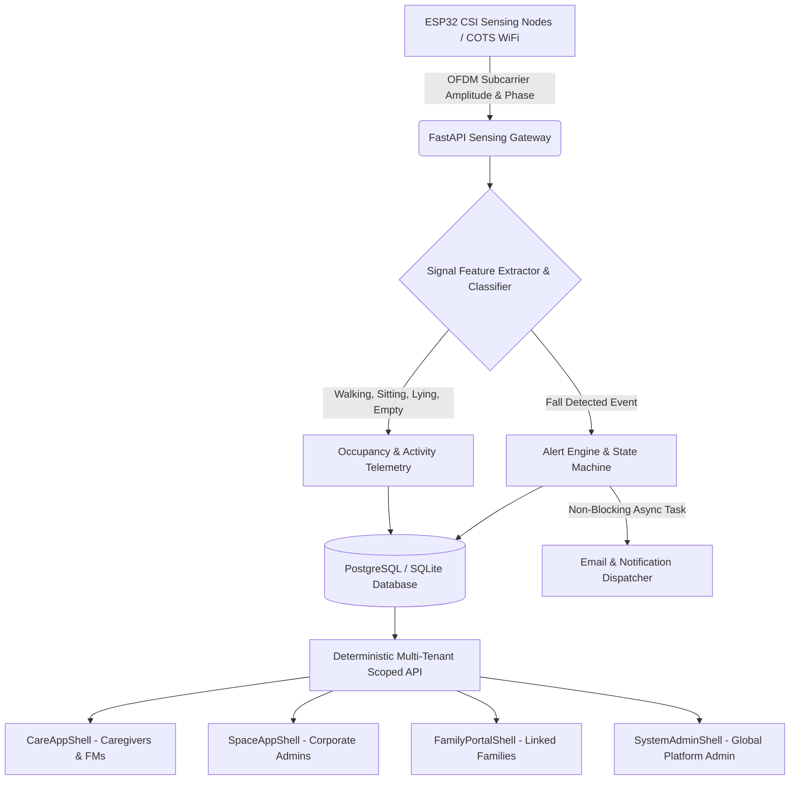

# Wi-Fi Sense Focus: Project Progress Report
**AI-Powered Indoor Monitoring and Facility Intelligence Platform Using Wi-Fi CSI**

* **Institution**: Amal Jyothi College of Engineering (Autonomous), Kanjirappally
* **Department**: Department of Computer Applications
* **Course**: Master of Computer Applications (MCA) — Mini Project (Phase 1)
* **Milestone**: Scrum Review 3 (~75% Project Completion)
* **Date**: September 21, 2026 (Presentation: September 22, 2026)
* **Project Guide / Scrum Master**: Assoc. Prof. Binumon Joseph
* **Student Candidate**: Blesson Joseph (Reg No: MCA Academic Project)
* **Code Repository**: `https://github.com/Blessonjoseph07/WIFISENSE`
* **Current Master Commit**: `76db278` (Post-merge of PR #4 & PR #5)

---

## 1. Project Overview & Motivation

### 1.1 Problem Statement
Indoor human monitoring has traditionally relied on two paradigms, both of which suffer from significant operational trade-offs:
1. **Vision-Based Camera Systems**: Highly effective for spatial tracking but severely compromise privacy in sensitive environments (e.g., resident bedrooms, restrooms in elder-care homes, or executive offices in corporate environments). Furthermore, optical cameras are vulnerable to occlusion, poor lighting, and blind spots.
2. **Wearable Sensor Devices (Smart bands, Pendants)**: Require continuous battery management, physical compliance, and are frequently forgotten or discarded by elderly residents, particularly those suffering from cognitive impairments such as dementia.

### 1.2 Proposed Solution: Wi-Fi CSI Sensing
**Wi-Fi Sense Focus** introduces a device-free, privacy-preserving monitoring and facility intelligence system leveraging **Wi-Fi Channel State Information (CSI)**. Physical movements, human posture variations, and fall events modulate the subcarrier amplitude and phase of multi-carrier Orthogonal Frequency Division Multiplexing (OFDM) signals transmitted between commercial off-the-shelf (COTS) Wi-Fi access points and ESP32 IoT nodes.

The system processes these perturbations in real-time, executing activity classification and fall detection without capturing optical imagery or requiring wearable tags.

---

## 2. System Architecture & Domain Model

Wi-Fi Sense Focus operates as a dual-context enterprise platform sharing a unified relational core:
- **CARE Context (Elder-Care / Assisted Living Facilities)**: Real-time resident presence, bed-exit tracking, fall detection escalation, multi-stage alert lifecycle, caregiver assignment, emergency contact routing, and subscriber-gated family portal.
- **SPACE Context (Corporate / Commercial Facilities)**: Room occupancy monitoring, meeting room capacity utilization, HVAC/lighting energy conservation recommendations, and unexpected after-hours occupancy alerts.

---

## 3. Implemented Modules & Coding Progress (~75% Milestone)

| Module / Component | Implementation Details | Completion Status |
| :--- | :--- | :---: |
| **Relational Schema & DB** | 3NF normalized schema across 22 relational entities (`User`, `Role`, `Organization`, `Building`, `Floor`, `Room`, `SensingDevice`, `SensingEvent`, `Alert`, `Resident`, `SharingPolicy`, `AuditLog`, `RefreshToken`, etc.). Migrations managed via Alembic. | **100%** |
| **Security & Authentication** | Dual-token authentication (15-min JWT access token + rotating 7-day refresh token), compromised refresh token reuse detection, server-side logout blacklist (`TokenRevocation`), password hashing (bcrypt), and rate-limiting. | **95%** |
| **Deterministic RBAC & Scopes** | 7 canonical roles with strict hierarchical scoping (`system_admin`, `organization_admin`, `facility_manager`, `caregiver`, `corporate_staff`, `emergency_contact`, `family_member`). Global Admin oversight separated from local clinical intervention. | **95%** |
| **Sensing Ingestion Engine** | Telemetry ingestion endpoint (`POST /sensing/events`), 56-subcarrier phase/amplitude parsing, event persistence, and automated alert trigger integration. | **85%** |
| **Alert Lifecycle & Escalation** | Multi-stage alert state machine (`new` / `DETECTED` → `ACKNOWLEDGED` → `RESPONDING` → `RESOLVED`). User attribution for acknowledge and resolve actions, prevention of duplicate transitions. | **90%** |
| **Sharing Policy System** | Fine-grained data sharing policies per organization (`share_presence`, `share_activities`, `share_alert_history`, `severity_threshold`). Integrated UI in `OrgAdminView` and `CareAppShell`. | **90%** |
| **Family Portal & Subscriptions** | Resident status endpoints with subscription status gating (`ACTIVE`, `PENDING`, `EXPIRED`, `SUSPENDED`). Caregiver shift notes and medical profile access boundaries. | **85%** |
| **Frontend UI Shells** | Multi-context React 19 + Vite dashboard featuring dedicated shells: `CareAppShell`, `SpaceAppShell`, `FamilyPortalShell`, `SystemAdminShell`, and splash views (`LandingSplash`, `ElderCareSplash`, `CorporateSplash`). | **85%** |
| **Automated Testing Suite** | 48 automated test cases covering business logic, boundaries, RBAC, security, and UI flows. Continuous verification via command line and CI workflows. | **90%** |
| **Overall Project Completion** | **Weighted Progress across Backend, Frontend, Testing & Documentation** | **~75%** |

---

## 4. Sprint & Scrum Register Tracking

### Sprint 1: Architectural Foundation & Multi-Tenant Core (Weeks 1–3)
- Established 3NF relational database schema and SQLModel entities.
- Implemented multi-tenant hierarchy (`Organization` → `Building` → `Floor` → `Room`).
- Implemented base authentication endpoints (`/auth/login`, `/auth/register`) and role seeds.

### Sprint 2: Clinical Care Records & Boundary Enforcement (Weeks 4–6)
- Implemented resident profile models: `EmergencyContact`, `Doctor`, `HospitalVisit`, `LabReport`, `Prescription`.
- Enforced strict 403 / empty-list multi-tenant boundary checks in `test_boundaries.py`.
- Developed initial React dashboard with interactive room cards, SVG floorplans, and alert badge counters.

### Sprint 3: Security Hardening, Sharing Policy UI & Reconciled Telemetry (Weeks 7–9)
- **Phase 1 Security**: Deployed rotating refresh tokens, server-side revocation blacklist, structured audit logging (`AuditLog`), and production credential safeguards (`test_phase1_security.py`).
- **Feature PR #4**: Integrated SharingPolicy management UI in `OrgAdminView` and `CareAppShell`, backed by navigation gating and end-to-end API integration tests (`test_ui_flow_sharing_policy.py`).
- **Feature PR #5**: Unified sensing pipeline, alert lifecycle state attribution, non-blocking asynchronous email notification dispatch, and photo upload anti-disguise magic-byte verification (`test_business_logic.py`).
- **Refined RBAC**: Resolved Global Admin oversight model (`test_global_admin_alert_access.py`), allowing system-wide visibility while preserving on-site operational roles.

---

## 5. Software Testing & Quality Metrics

All test suites were executed on the consolidated `master` branch (commit `76db278`):
- **Backend Test Cases**: 48 tests executed, 48 passed (100% pass rate).
- **Security Validation**: 0 compromised refresh token reuses permitted; 100% of revoked access tokens blocked with HTTP 401.
- **Frontend Build**: `npm run build` completed in 6.06s with 0 errors across 48 modules.
- **Static Code Analysis**: `npm run lint` reported 0 errors across 34 source files.

*(Complete logs, assertions, and execution commands are documented in [`docs/testing_report.md`](file:///d:/Wifisense/docs/testing_report.md)).*

---

## 6. Next Steps for Sprint 4 (Targeting 100% Completion)

1. **Analytics Care vs. Corporate Classification**: Rebase and merge `feature/analytics-classification` (PR #6) to deliver distinct breakdown metrics for occupancy and alert distributions.
2. **Real-Time WebSocket Gateway**: Implement `/ws/stream` WebSocket endpoint with JWT authentication for live subcarrier streaming and instant push notifications.
3. **Hardware Gateway Integration**: Validate ESP32 UDP packet ingestion from real CSI firmware nodes.
4. **Final Documentation & Project Viva Preparation**: Complete academic dissertation report and presentation slide deck for final review.
